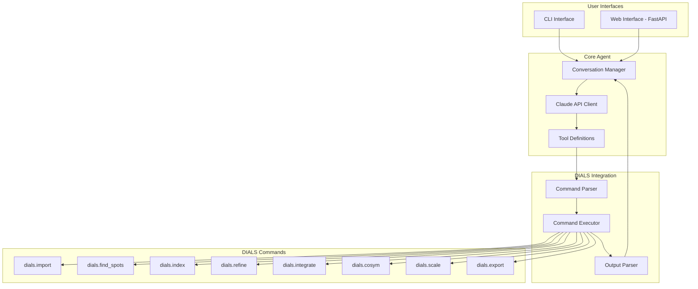
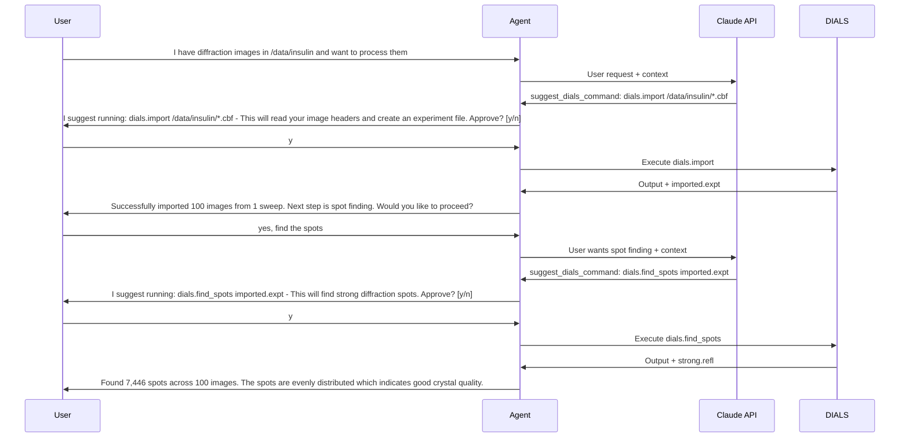

# DIALS AI Agent - Architecture Plan

## Overview

This document outlines the architecture for an AI-powered agent that enables users with less command-line experience to process crystallography data using DIALS through natural language interactions.

## Goals

1. Allow users to describe their data processing goals in natural language
2. Translate user intent into appropriate DIALS commands
3. Execute commands with user approval (semi-automated workflow)
4. Parse and summarize DIALS output in human-readable format
5. Provide both CLI and Web interfaces

## Architecture Diagram



## Component Details

### 1. User Interfaces

#### CLI Interface
- Python-based terminal application using `rich` for formatted output
- Interactive conversation loop
- Command approval prompts before execution
- Progress indicators during command execution

#### Web Interface
- FastAPI backend with REST API endpoints
- Simple HTML/JavaScript frontend (or React for richer UX)
- WebSocket support for real-time output streaming
- Session management for conversation context

### 2. Core Agent Module

#### Conversation Manager
- Maintains conversation history within a session
- Handles user input and formats responses
- Manages the approval workflow for command execution

#### Claude API Client
- Integrates with Anthropic Claude API
- Uses tool/function calling for structured command generation
- System prompt with DIALS domain knowledge
- Handles API errors and rate limiting

#### Tool Definitions
Claude will have access to these tools:

```python
tools = [
    {
        "name": "suggest_dials_command",
        "description": "Suggest a DIALS command to execute based on user request",
        "input_schema": {
            "type": "object",
            "properties": {
                "command": {
                    "type": "string",
                    "description": "The DIALS command to execute"
                },
                "explanation": {
                    "type": "string", 
                    "description": "Human-readable explanation of what this command does"
                },
                "expected_output": {
                    "type": "string",
                    "description": "What the user should expect from this command"
                }
            },
            "required": ["command", "explanation"]
        }
    },
    {
        "name": "check_workflow_status",
        "description": "Check what files exist and what step of the workflow we are at",
        "input_schema": {
            "type": "object",
            "properties": {
                "working_directory": {
                    "type": "string",
                    "description": "Directory to check for DIALS files"
                }
            },
            "required": ["working_directory"]
        }
    },
    {
        "name": "explain_dials_concept",
        "description": "Explain a DIALS concept or parameter to the user",
        "input_schema": {
            "type": "object",
            "properties": {
                "concept": {
                    "type": "string",
                    "description": "The concept to explain"
                }
            },
            "required": ["concept"]
        }
    }
]
```

### 3. DIALS Integration

#### Command Parser
- Validates DIALS commands before execution
- Extracts parameters and file paths
- Maps natural language parameters to DIALS phil syntax

#### Command Executor
- Runs DIALS commands as subprocesses
- Captures stdout, stderr, and return codes
- Handles timeouts for long-running commands
- Provides progress updates where possible

#### Output Parser
- Parses DIALS output for key metrics:
  - Import: number of images, sequences, format
  - Find spots: spot counts per image, total spots
  - Index: unit cell, space group, indexed percentage
  - Refine: RMS deviations, refined parameters
  - Integrate: integrated reflections, resolution
  - Scale: Rmerge, completeness, multiplicity
  - Export: output file paths

### 4. System Prompt

The Claude system prompt will include:

1. **Role Definition**: Expert crystallographer assistant
2. **DIALS Workflow Knowledge**: Standard processing pipeline
3. **Command Reference**: Available commands and common parameters
4. **Output Interpretation**: How to read DIALS output
5. **Best Practices**: When to use which parameters
6. **Error Handling**: Common errors and solutions

**📚 See [dials_ai_agent_knowledge_base.md](dials_ai_agent_knowledge_base.md) for the complete system prompt and knowledge base documentation, including:**
- Full system prompt text for Claude
- Detailed command reference for all DIALS commands
- Output parsing patterns and regular expressions
- Workflow state management
- Error patterns and solutions
- Quality thresholds for data assessment
- Example conversations

## Project Structure

```
dials_agent/
├── __init__.py
├── cli.py                    # CLI interface
├── web/
│   ├── __init__.py
│   ├── app.py               # FastAPI application
│   ├── routes.py            # API endpoints
│   └── static/              # Frontend files
│       ├── index.html
│       ├── style.css
│       └── app.js
├── core/
│   ├── __init__.py
│   ├── agent.py             # Main agent class
│   ├── claude_client.py     # Anthropic API wrapper
│   ├── tools.py             # Tool definitions
│   └── prompts.py           # System prompts
├── dials/
│   ├── __init__.py
│   ├── commands.py          # Command definitions
│   ├── executor.py          # Command execution
│   ├── parser.py            # Output parsing
│   └── workflow.py          # Workflow state management
├── config.py                # Configuration
├── requirements.txt
└── README.md
```

## Workflow Example

### User Interaction Flow



## Key Features

### 1. Natural Language Understanding
- "Process my insulin data" → Full pipeline suggestion
- "Find spots with higher threshold" → Adjust spotfinder.threshold parameters
- "Index with known unit cell 37,79,79,90,90,90" → Add unit_cell parameter
- "Why did indexing fail?" → Analyze output and suggest solutions

### 2. Context Awareness
- Track current working directory
- Know which files exist (imported.expt, strong.refl, etc.)
- Understand current workflow stage
- Remember previous commands in session

### 3. Error Handling
- Parse error messages from DIALS
- Suggest fixes for common problems
- Explain what went wrong in plain language

### 4. Output Summarization
- Extract key metrics from verbose output
- Highlight important warnings
- Provide quality assessments

## Configuration

```python
# config.py
from pydantic import BaseSettings

class Settings(BaseSettings):
    anthropic_api_key: str
    model: str = "claude-sonnet-4-20250514"
    max_tokens: int = 4096
    dials_path: str = ""  # Path to DIALS installation, empty for system PATH
    working_directory: str = "."
    command_timeout: int = 3600  # 1 hour max for long integrations
    
    class Config:
        env_file = ".env"
```

## Dependencies

```
# requirements.txt
anthropic>=0.18.0
fastapi>=0.109.0
uvicorn>=0.27.0
rich>=13.7.0
pydantic>=2.5.0
python-dotenv>=1.0.0
websockets>=12.0
```

## Implementation Phases

### Phase 1: Core Agent
- Claude API integration
- Basic tool definitions
- Command executor
- Simple output parsing

### Phase 2: CLI Interface
- Interactive conversation loop
- Command approval workflow
- Formatted output display

### Phase 3: Output Parsing
- Detailed parsers for each DIALS command
- Quality metrics extraction
- Error message parsing

### Phase 4: Web Interface
- FastAPI backend
- Simple web frontend
- Real-time output streaming

### Phase 5: Enhanced Features
- Workflow state persistence
- Advanced error recovery
- Parameter optimization suggestions

## Security Considerations

1. **API Key Management**: Store Anthropic API key in environment variables
2. **Command Validation**: Sanitize and validate all commands before execution
3. **Path Restrictions**: Limit file access to designated directories
4. **Rate Limiting**: Implement rate limiting for web API

## Testing Strategy

1. **Unit Tests**: Test individual components (parser, executor, etc.)
2. **Integration Tests**: Test full workflow with mock DIALS commands
3. **End-to-End Tests**: Test with real DIALS installation and sample data

## Future Enhancements

1. **Multi-crystal Processing**: Guide users through processing multiple crystals
2. **Data Quality Assessment**: Automated quality checks and recommendations
3. **Visualization Integration**: Launch dials.image_viewer or dials.reciprocal_lattice_viewer
4. **Pipeline Templates**: Pre-defined workflows for common scenarios
5. **Learning from Feedback**: Improve suggestions based on user corrections
