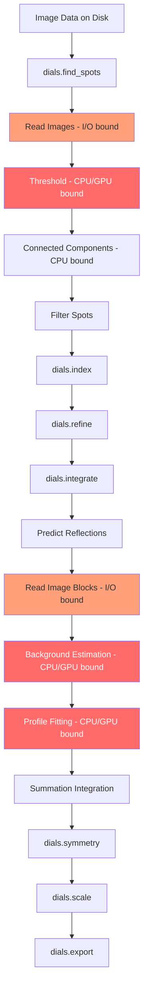

# DIALS Performance Bottleneck Analysis

## Timing Baseline (Insulin dataset, 1200 images, 8 cores)

| Step | Duration | % of Total |
|------|----------|-----------|
| `dials.find_spots` | **6m 13.6s** | **39%** |
| `dials.integrate` | **5m 58.0s** | **37%** |
| `dials.scale` | 1m 1.4s | 6% |
| `dials.refine` | 50.5s | 5% |
| `dials.index` | 49.9s | 5% |
| `dials.symmetry` | 49.7s | 5% |
| `dials.export` | 8.3s | <1% |
| `dials.import` | 3.4s | <1% |
| **Total** | **15m 54.9s** | **100%** |

**Two steps dominate: spot finding (39%) and integration (37%) account for 76% of total time.**

---

## 1. `dials.find_spots` — Architecture & Bottlenecks

### How it works (source: `modules/dials/src/dials/algorithms/spot_finding/`)

```
For each image in the dataset:
  1. Read image data from disk (HDF5/CBF)
  2. Apply mask
  3. Run threshold algorithm (dispersion_extended) per panel
     → C++ kernel: DispersionExtendedThreshold
     → Computes local mean/variance in a sliding kernel window
     → Classifies pixels as strong if I > mean + n_sigma * sqrt(variance)
  4. Build PixelList from thresholded mask
  5. Accumulate into PixelListLabeller

After all images:
  6. Connected component labelling (3D across frames)
  7. Create shoeboxes from pixel lists
  8. Compute centroids and intensities
  9. Filter spots (size, resolution, etc.)
```

### Where time is spent

| Sub-step | Estimated % | Implementation |
|----------|------------|----------------|
| Image I/O (HDF5 decompression) | ~20-30% | dxtbx, h5py, hdf5plugin |
| Threshold computation | ~40-50% | C++ (`DispersionThreshold`) |
| Connected component labelling | ~10-15% | C++ (`PixelListShoeboxCreator`) |
| Centroid/intensity calculation | ~5-10% | C++ (flex arrays) |
| Python overhead/serialization | ~5-10% | multiprocessing pickle |

### Current parallelism

- Uses Python `multiprocessing` via `batch_multi_node_parallel_map`
- Each process handles a **chunk** of images independently
- Pixel lists are pickled back to the main process and accumulated
- Connected component labelling happens **serially** in the main process after all images are processed
- **Key limitation**: The GIL doesn't matter (multiprocessing), but pickle serialization of pixel lists is overhead

### Optimization opportunities

1. **GPU-accelerated thresholding** (HIGH IMPACT)
   - The dispersion threshold is a sliding-window mean/variance computation — classic GPU workload
   - Each image panel is independent — embarrassingly parallel
   - Could use CUDA, OpenCL, or Metal (via CuPy, PyOpenCL, or custom kernels)
   - The C++ `DispersionThreshold` class in `dials/algorithms/image/threshold/` is the target

2. **Reduce I/O bottleneck** (MEDIUM IMPACT)
   - HDF5 with bitshuffle/LZ4 compression requires CPU decompression
   - Could use `hdf5plugin` with hardware-accelerated decompression
   - Pre-loading images into shared memory could reduce per-process I/O
   - Using memory-mapped files or DRAM caching for repeated access

3. **Avoid pickle serialization** (MEDIUM IMPACT)
   - Current multiprocessing pickles pixel lists between processes
   - Could use shared memory (`multiprocessing.shared_memory`) to avoid serialization
   - Or use threading with C++ extensions that release the GIL

4. **Parallelize connected component labelling** (LOW-MEDIUM IMPACT)
   - Currently serial after all images are processed
   - Could be done incrementally as chunks complete
   - Or parallelized across panels

5. **Reduce image range** (QUICK WIN — already available)
   - `scan_range=1,600` processes half the images
   - `d_min=2.0` limits resolution range (fewer pixels to threshold)

---

## 2. `dials.integrate` — Architecture & Bottlenecks

### How it works (source: `modules/dials/src/dials/algorithms/integration/`)

```
1. Predict reflection positions (from crystal model)
2. Create profile model from reference spots
3. Split reflections into blocks (by rotation angle)
4. For each block:
   a. Read images for the block
   b. Allocate shoeboxes (3D pixel arrays around each reflection)
   c. Extract pixel data into shoeboxes
   d. Compute background (GLM robust estimator)
   e. Profile fitting (match observed to reference profile)
   f. Summation integration (fallback)
5. Combine results from all blocks
6. Filter and report
```

### Where time is spent

| Sub-step | Estimated % | Implementation |
|----------|------------|----------------|
| Image I/O (reading blocks) | ~15-25% | dxtbx, HDF5 |
| Shoebox allocation/extraction | ~15-20% | C++ (`ShoeboxProcessor`) |
| Background estimation | ~20-30% | C++ (GLM robust fitting) |
| Profile fitting | ~25-35% | C++ (least-squares fitting) |
| Python overhead | ~5-10% | multiprocessing, data management |

### Current parallelism

- Uses `multi_node_parallel_map` for block-level parallelism
- Each block is processed independently by a worker process
- Block size is auto-calculated based on memory constraints
- C++ extensions (`dials_algorithms_integration_integrator_ext`) do the heavy lifting
- Memory-limited: `max_memory_usage = 0.90` controls block size

### Optimization opportunities

1. **GPU-accelerated profile fitting** (HIGH IMPACT)
   - Profile fitting is essentially a per-reflection least-squares problem
   - Thousands of reflections can be fitted simultaneously on GPU
   - Background estimation (GLM) is also parallelizable per-reflection
   - This is the single biggest opportunity

2. **GPU-accelerated background estimation** (HIGH IMPACT)
   - The GLM robust background model fits a 3D model to each shoebox
   - Each shoebox is independent — perfect for GPU parallelism
   - Could batch all shoeboxes in a block and process on GPU

3. **Reduce I/O with block caching** (MEDIUM IMPACT)
   - Images are re-read for each block
   - If blocks overlap in image range, same images are read multiple times
   - Caching or pre-loading could help

4. **Threading instead of multiprocessing** (MEDIUM IMPACT)
   - The C++ extensions could release the GIL
   - Threading avoids pickle serialization overhead
   - The `3d_threaded` integrator option exists but is marked expert-level

5. **Summation-only integration** (QUICK WIN — already available)
   - `profile.fitting=False` skips profile fitting (the most expensive step)
   - Reduces quality but dramatically speeds up integration
   - Good for initial screening

6. **Resolution limit** (QUICK WIN — already available)
   - `prediction.d_min=2.0` reduces the number of reflections to integrate
   - Fewer reflections = less computation

---

## Summary of Optimization Strategies

### Quick Wins (no code changes to DIALS)

| Strategy | Expected Speedup | How |
|----------|-----------------|-----|
| More CPU cores | ~2x with 16 cores | `nproc=16` |
| Summation-only integration | ~2x for integrate step | `profile.fitting=False` |
| Resolution limit | ~1.5x | `prediction.d_min=2.0` |
| Reduce image range | Linear | `scan_range=1,600` |

### Medium-term (Python-level changes)

| Strategy | Expected Speedup | Complexity |
|----------|-----------------|------------|
| Shared memory for pixel lists | ~1.2-1.5x for find_spots | Medium |
| Threading with GIL-free C++ | ~1.3x | Medium |
| Block caching for integration | ~1.2x | Medium |
| Incremental connected components | ~1.1x | Low |

### Long-term (GPU acceleration)

| Strategy | Expected Speedup | Complexity |
|----------|-----------------|------------|
| GPU threshold (find_spots) | ~5-10x for threshold step | High |
| GPU profile fitting (integrate) | ~5-10x for fitting step | High |
| GPU background estimation | ~3-5x for background step | High |
| End-to-end GPU pipeline | ~3-5x overall | Very High |

### Architecture Diagram



Red = primary computational bottlenecks, Orange = I/O bottlenecks

---

## Key Source Files

| Component | Path |
|-----------|------|
| find_spots CLI | `modules/dials/src/dials/command_line/find_spots.py` |
| Spot finder | `modules/dials/src/dials/algorithms/spot_finding/finder.py` |
| Threshold strategies | `modules/dials/src/dials/algorithms/spot_finding/threshold.py` |
| Spot finder factory | `modules/dials/src/dials/algorithms/spot_finding/factory.py` |
| C++ threshold | `modules/dials/src/dials/algorithms/image/threshold/` |
| C++ spot finding ext | `modules/dials/src/dials/algorithms/spot_finding/boost_python/spot_finding_ext.cc` |
| integrate CLI | `modules/dials/src/dials/command_line/integrate.py` |
| Integrator | `modules/dials/src/dials/algorithms/integration/integrator.py` |
| Processor | `modules/dials/src/dials/algorithms/integration/processor.py` |
| C++ integrator ext | `dials_algorithms_integration_integrator_ext` (compiled) |
| Parallel integrator | `modules/dials/src/dials/algorithms/integration/parallel_integrator.py` |
