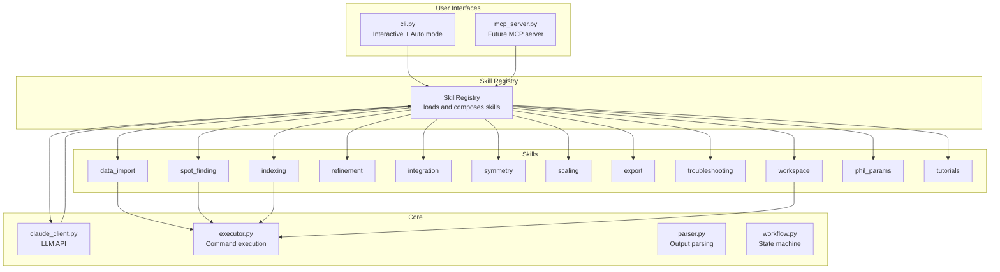

# DIALS Agent: Skills-Based Architecture Refactoring Plan

> **Status**: Implemented 2026-07-12 (`dials_agent/skills/`). Steps 1-11 of the plan below are done, including CLI handler decoupling (Section 8) — skill handlers return plain dicts, with two host-only conventions: an `_cli_print` key for display-only messages, and a `requires_confirmation` / `_confirmed` round trip for destructive shell commands. 20 tests added in `tests/test_skills.py` (registry/skill level) plus 18 in `tests/test_cli_dispatch.py` (the `DIALSAgent._handle_tool_call` wrapper: `_cli_print`/host-key stripping, the destructive-command confirm round-trip, and working/data-directory state mutation) — 76 total passing across the test suite. The MCP server (Section 12) is still future work.
> **Created**: 2026-06-24
> **Baseline code version**: v1.2.0 (as of 2026-06-24); implemented against the codebase as of 2026-07-12, after the token-usage-display/markdown-HTML-tools PR (#1) was merged, which had already changed line numbers in `prompts.py`/`tools.py`/`cli.py`/`claude_client.py` from the baseline. Section headers and content descriptions were used to relocate the correct code rather than the stale line numbers.
> **Note**: Line numbers above reference the codebase as of the creation date and are now stale; see the file list in Section 9 for the actual result.

## 1. Overview

This plan refactors the DIALS agent from a monolithic architecture (single 960-line system prompt, flat tool list, single handler chain) into a **skills-based modular architecture** where each skill is a self-contained unit of domain knowledge, tool definitions, and handler logic.

### Goals

1. **Modular knowledge** — Each skill bundles its own prompt fragment, tools, and handlers
2. **Composable** — Skills can be loaded selectively or all at once
3. **MCP-ready** — Skills provide clean, CLI-independent handlers that an MCP server can wrap directly
4. **Backward compatible** — Loading all skills produces identical behavior to the current agent
5. **Testable** — Each skill can be tested independently

### Non-Goals

- Building the MCP server (separate follow-up effort)
- Changing the user-facing CLI interface
- Changing the LLM provider integration
- Rewriting the executor, parser, or workflow manager

---

## 2. Architecture

### Current Architecture

```
dials_agent/
├── cli.py                    # 1779 lines — CLI + DIALSAgent class + 500-line handler chain
├── core/
│   ├── claude_client.py      # 546 lines — LLM client
│   ├── prompts.py            # 963 lines — ONE monolithic system prompt string
│   ├── tools.py              # 1229 lines — 15 tool defs + helpers + PHIL lookup + diagnosis
│   └── tutorials.py          # 406 lines — Tutorial definitions (already modular)
├── dials/
│   ├── commands.py           # 2210 lines — Command metadata (already modular)
│   ├── executor.py           # Command execution
│   ├── parser.py             # Output parsing
│   └── workflow.py           # Workflow state machine
```

### Target Architecture

```
dials_agent/
├── cli.py                    # SLIMMED — CLI loop only, delegates to SkillRegistry
├── core/
│   ├── claude_client.py      # MODIFIED — composes prompt from loaded skills
│   ├── prompts.py            # SLIMMED — only base prompt (role + concepts + guidelines)
│   ├── tools.py              # SLIMMED — only shared utilities (discover_data_files, etc.)
│   └── tutorials.py          # UNCHANGED
├── skills/                   # NEW — modular skill modules
│   ├── __init__.py           # SkillRegistry + loader
│   ├── base.py               # BaseSkill class
│   ├── data_import.py        # Import + data discovery skill
│   ├── spot_finding.py       # Spot finding skill
│   ├── indexing.py           # Indexing + Bravais settings skill
│   ├── refinement.py         # Refinement skill
│   ├── integration.py        # Integration skill
│   ├── symmetry.py           # Symmetry + cosym skill
│   ├── scaling.py            # Scaling + merging skill
│   ├── export.py             # Export skill
│   ├── troubleshooting.py    # Problem diagnosis skill
│   ├── workspace.py          # File I/O, directory management, shell commands
│   ├── phil_params.py        # PHIL parameter lookup skill
│   └── tutorials.py          # Tutorial workflow skill (wraps core/tutorials.py)
├── dials/
│   ├── commands.py           # UNCHANGED
│   ├── executor.py           # UNCHANGED
│   ├── parser.py             # UNCHANGED
│   └── workflow.py           # UNCHANGED
```

### Architectural Diagram



---

## 3. Skill Base Class

Each skill is a Python class that provides three things:

```python
# dials_agent/skills/base.py

from abc import ABC, abstractmethod
from dataclasses import dataclass, field
from typing import Any, Callable, Optional


@dataclass
class SkillContext:
    """Shared context passed to skill handlers."""
    working_directory: str = "."
    workflow_stage: str = "none"
    existing_files: list[str] = field(default_factory=list)
    executor: Any = None       # CommandExecutor instance
    parser: Any = None         # OutputParser instance
    workflow: Any = None       # WorkflowManager instance


class BaseSkill(ABC):
    """Base class for all DIALS agent skills."""

    @property
    @abstractmethod
    def name(self) -> str:
        """Unique skill identifier (e.g., 'spot_finding')."""
        ...

    @property
    @abstractmethod
    def description(self) -> str:
        """Human-readable description of what this skill provides."""
        ...

    @abstractmethod
    def get_prompt_fragment(self) -> str:
        """Return the system prompt fragment for this skill.
        
        This is the portion of the system prompt that teaches the LLM
        about this skill's domain. It will be composed with other skills'
        fragments to form the complete system prompt.
        """
        ...

    @abstractmethod
    def get_tools(self) -> list[dict]:
        """Return the tool definitions (JSON schemas) for this skill.
        
        Each tool is a dict with 'name', 'description', and 'input_schema'.
        """
        ...

    @abstractmethod
    def handle_tool_call(
        self,
        tool_name: str,
        tool_input: dict,
        context: SkillContext,
    ) -> dict:
        """Handle a tool call for this skill.
        
        Args:
            tool_name: Name of the tool being called
            tool_input: Input parameters from the LLM
            context: Shared context (working directory, executor, etc.)
            
        Returns:
            Result dictionary to send back to the LLM
            
        Raises:
            KeyError: If tool_name is not handled by this skill
        """
        ...

    def get_tool_names(self) -> list[str]:
        """Return the list of tool names this skill handles."""
        return [t["name"] for t in self.get_tools()]
```

---

## 4. Skill Registry

```python
# dials_agent/skills/__init__.py

class SkillRegistry:
    """Registry that loads, composes, and dispatches to skills."""

    def __init__(self):
        self._skills: dict[str, BaseSkill] = {}
        self._tool_to_skill: dict[str, BaseSkill] = {}

    def register(self, skill: BaseSkill):
        """Register a skill."""
        self._skills[skill.name] = skill
        for tool_name in skill.get_tool_names():
            if tool_name in self._tool_to_skill:
                raise ValueError(
                    f"Tool '{tool_name}' already registered by "
                    f"skill '{self._tool_to_skill[tool_name].name}'"
                )
            self._tool_to_skill[tool_name] = skill

    def get_composed_prompt(self) -> str:
        """Compose all skill prompt fragments into one system prompt."""
        fragments = [skill.get_prompt_fragment() for skill in self._skills.values()]
        return "\n\n".join(fragments)

    def get_all_tools(self) -> list[dict]:
        """Get all tool definitions from all registered skills."""
        tools = []
        for skill in self._skills.values():
            tools.extend(skill.get_tools())
        return tools

    def handle_tool_call(self, tool_name: str, tool_input: dict, context: SkillContext) -> dict:
        """Dispatch a tool call to the appropriate skill."""
        skill = self._tool_to_skill.get(tool_name)
        if skill is None:
            return {"error": f"Unknown tool: {tool_name}"}
        return skill.handle_tool_call(tool_name, tool_input, context)

    def get_skill(self, name: str) -> BaseSkill | None:
        """Get a skill by name."""
        return self._skills.get(name)

    @property
    def skill_names(self) -> list[str]:
        return list(self._skills.keys())


def create_default_registry() -> SkillRegistry:
    """Create a registry with all default skills loaded."""
    from .data_import import DataImportSkill
    from .spot_finding import SpotFindingSkill
    from .indexing import IndexingSkill
    from .refinement import RefinementSkill
    from .integration import IntegrationSkill
    from .symmetry import SymmetrySkill
    from .scaling import ScalingSkill
    from .export import ExportSkill
    from .troubleshooting import TroubleshootingSkill
    from .workspace import WorkspaceSkill
    from .phil_params import PhilParamsSkill
    from .tutorials import TutorialsSkill

    registry = SkillRegistry()
    for skill_class in [
        DataImportSkill,
        SpotFindingSkill,
        IndexingSkill,
        RefinementSkill,
        IntegrationSkill,
        SymmetrySkill,
        ScalingSkill,
        ExportSkill,
        TroubleshootingSkill,
        WorkspaceSkill,
        PhilParamsSkill,
        TutorialsSkill,
    ]:
        registry.register(skill_class())
    return registry
```

---

## 5. Skill Decomposition — What Goes Where

### 5.1 Prompt Decomposition

The 960-line system prompt in `prompts.py` is split as follows:

| Prompt Section (current line range) | Target Skill | Approx Lines |
|---|---|---|
| Lines 8-57: Role, workflow overview, key concepts | **Base prompt** (stays in `prompts.py`) | 50 |
| Lines 60-79: `dials.import` command reference | `data_import` | 20 |
| Lines 81-101: `dials.find_spots` command reference | `spot_finding` | 20 |
| Lines 103-123: `dials.index` command reference | `indexing` | 20 |
| Lines 124-143: `dials.refine_bravais_settings` + `dials.reindex` | `indexing` | 20 |
| Lines 145-158: `dials.refine` command reference | `refinement` | 14 |
| Lines 159-176: `dials.integrate` command reference | `integration` | 18 |
| Lines 177-201: `dials.symmetry` + `dials.cosym` | `symmetry` | 25 |
| Lines 203-243: `dials.scale` + `dials.export` | `scaling` + `export` | 40 |
| Lines 244-508: Utility commands (show, report, merge, etc.) | Distributed across relevant skills | 265 |
| Lines 509-523: PHIL parameter lookup instructions | `phil_params` | 15 |
| Lines 524-532: Problem diagnosis instructions | `troubleshooting` | 9 |
| Lines 533-561: Quality indicators | Distributed across workflow skills | 29 |
| Lines 563-629: Troubleshooting guide | `troubleshooting` | 67 |
| Lines 631-696: Shell commands, file access, workspace | `workspace` | 66 |
| Lines 697-731: Timing, parallel computing, auto mode | `integration` (parallel) + base prompt (auto) | 35 |
| Lines 732-759: Calculations, counting, verification | `workspace` (calculate tool) | 28 |
| Lines 760-831: Response guidelines, import options | Base prompt + `data_import` | 72 |
| Lines 832-869: Scaling/export options, visualization | `scaling` + `export` + base prompt | 38 |
| Lines 870-907: Tutorial section, important notes | `tutorials` + base prompt | 38 |

### 5.2 Tool Decomposition

The 15 tools in `tools.py` are assigned to skills:

| Tool | Target Skill | Handler Source |
|---|---|---|
| `suggest_dials_command` | **Base** (shared across all workflow skills) | `cli.py` lines 96-103 |
| `check_workflow_status` | `workspace` | `cli.py` lines 105-107 |
| `explain_dials_concept` | **Base** (LLM handles this) | `cli.py` lines 109-113 |
| `analyze_dials_output` | **Base** (uses parser) | `cli.py` lines 116-139 |
| `suggest_troubleshooting` | `troubleshooting` | `cli.py` lines 141-146 |
| `list_available_commands` | `workspace` | `cli.py` lines 148-166 |
| `read_file` | `workspace` | `cli.py` lines 168-200 |
| `open_file` | `workspace` | `cli.py` lines 202-250 |
| `change_working_directory` | `workspace` | `cli.py` lines 252-331 |
| `change_data_directory` | `data_import` | `cli.py` lines 333-373 |
| `calculate` | `workspace` | `cli.py` lines 375-400 |
| `get_timing_report` | `workspace` | `cli.py` lines 402-415 |
| `run_shell_command` | `workspace` | `cli.py` lines 417-483 |
| `lookup_phil_params` | `phil_params` | `cli.py` lines 485-490 → `tools.py` lines 641-703 |
| `diagnose_problem` | `troubleshooting` | `cli.py` lines 492-498 → `tools.py` lines 1127-1228 |

### 5.3 Data Decomposition

| Data Structure | Current Location | Target Skill |
|---|---|---|
| `TOOLS` list (15 tool schemas) | `tools.py` lines 13-284 | Split across skills |
| `WORKFLOW_FILES` dict | `tools.py` lines 298-307 | `workspace` |
| `FILE_TO_STAGE` dict | `tools.py` lines 311-324 | `workspace` |
| `COMMAND_INFO` dict | `tools.py` lines 369-441 | `workspace` (or stays shared) |
| `DATA_FILE_EXTENSIONS` set | `tools.py` lines 467-476 | `data_import` |
| `discover_data_files()` function | `tools.py` lines 479-610 | `data_import` |
| `format_data_files_for_prompt()` | `tools.py` lines 613-630 | `data_import` |
| `lookup_phil_params()` function | `tools.py` lines 641-703 | `phil_params` |
| `PROBLEM_SOLUTIONS` dict | `tools.py` lines 711-1124 | `troubleshooting` |
| `diagnose_problem()` function | `tools.py` lines 1127-1228 | `troubleshooting` |
| `TUTORIALS` dict | `tutorials.py` lines 14-316 | `tutorials` (wraps existing) |
| `DIALS_COMMANDS` dict | `commands.py` lines 50-2210 | Stays in `commands.py` (shared) |

---

## 6. Example Skill Implementation

Here is what the `spot_finding` skill would look like:

```python
# dials_agent/skills/spot_finding.py

from .base import BaseSkill, SkillContext


class SpotFindingSkill(BaseSkill):

    @property
    def name(self) -> str:
        return "spot_finding"

    @property
    def description(self) -> str:
        return "Find diffraction spots on images using threshold algorithms"

    def get_prompt_fragment(self) -> str:
        return """## Spot Finding (dials.find_spots)

### dials.find_spots
- **Purpose**: Find strong diffraction spots using threshold algorithms
- **Usage**: `dials.find_spots imported.expt`
- **Output**: strong.refl
- **Key params**:
  - `spotfinder.threshold.algorithm=dispersion_extended` — Algorithm: dispersion, dispersion_extended, radial_profile
  - `spotfinder.threshold.dispersion.sigma_strong=3.0` — Sigma threshold (higher = fewer spots)
  - `spotfinder.threshold.dispersion.sigma_background=6.0` — Background sigma threshold
  - `spotfinder.threshold.dispersion.global_threshold=0` — Global intensity threshold
  - `spotfinder.filter.d_min=2.0` — High resolution limit (Angstrom)
  - `spotfinder.filter.d_max=50` — Low resolution limit (Angstrom)
  - `spotfinder.filter.min_spot_size=Auto` — Minimum spot size (pixels)
  - `spotfinder.filter.max_spot_size=1000` — Maximum spot size (pixels)
  - `spotfinder.filter.ice_rings.filter=True` — Filter ice ring regions
  - `spotfinder.scan_range=1,100` — Image range to search
  - `spotfinder.mp.nproc=4` — Number of processes

### Spot Finding Quality Indicators
- Good: 5,000-50,000 spots total
- Spots should be evenly distributed across images
- Very few spots (< 1000): lower sigma_strong, check data quality
- Too many spots (> 100,000): raise sigma_strong, check for powder rings

### Parallel Computing for Spot Finding
**MANDATORY**: When suggesting `dials.find_spots`, ask the user how many CPU cores to use.
- Parameter: `spotfinder.mp.nproc=N`
- Default: Auto (uses all available cores)
- More cores = faster but higher memory usage
"""

    def get_tools(self) -> list[dict]:
        # Spot finding uses the shared suggest_dials_command tool
        # No skill-specific tools needed
        return []

    def handle_tool_call(self, tool_name: str, tool_input: dict, context: SkillContext) -> dict:
        raise KeyError(f"SpotFindingSkill does not handle tool '{tool_name}'")
```

Note: Most workflow skills (spot_finding, indexing, refinement, etc.) contribute **prompt fragments** but don't define their own tools — they use the shared `suggest_dials_command` tool. The skills that define tools are `workspace`, `phil_params`, `troubleshooting`, `data_import`, and the base/shared tools.

---

## 7. Implementation Steps

### Step 1: Create skill infrastructure
- Create `dials_agent/skills/` directory
- Create `base.py` with `BaseSkill` and `SkillContext`
- Create `__init__.py` with `SkillRegistry` and `create_default_registry()`

### Step 2: Extract workspace skill (largest, most tools)
- Move 7 tools from `tools.py`/`cli.py`: `check_workflow_status`, `read_file`, `open_file`, `change_working_directory`, `calculate`, `get_timing_report`, `run_shell_command`, `list_available_commands`
- Move corresponding prompt sections (shell commands, file access, workspace management, calculations)
- Move `WORKFLOW_FILES`, `FILE_TO_STAGE`, `COMMAND_INFO` data structures
- **Critical**: Decouple handlers from CLI-specific code (Rich console, Confirm prompts)

### Step 3: Extract phil_params skill
- Move `lookup_phil_params` tool definition and handler
- Move `lookup_phil_params()` function and `_PHIL_PARAMS_DIR`
- Move PHIL parameter lookup prompt section

### Step 4: Extract troubleshooting skill
- Move `suggest_troubleshooting` and `diagnose_problem` tool definitions and handlers
- Move `PROBLEM_SOLUTIONS` dict and `diagnose_problem()` function
- Move troubleshooting prompt section

### Step 5: Extract data_import skill
- Move `change_data_directory` tool definition and handler
- Move `DATA_FILE_EXTENSIONS`, `discover_data_files()`, `format_data_files_for_prompt()`
- Move import command reference and import options prompt sections

### Step 6: Extract workflow skills (spot_finding through export)
- Each skill gets its command reference prompt fragment
- Each skill gets its quality indicators
- No new tools — they use shared `suggest_dials_command`
- These are primarily prompt-only skills

### Step 7: Extract tutorials skill
- Wrap existing `core/tutorials.py` as a skill
- Move tutorial prompt section

### Step 8: Refactor base prompt
- Keep only: role definition, workflow overview, key concepts, response guidelines, auto mode instructions
- Keep shared tools: `suggest_dials_command`, `explain_dials_concept`, `analyze_dials_output`

### Step 9: Refactor claude_client.py
- Accept `SkillRegistry` instead of raw prompt/tools
- Compose system prompt from `registry.get_composed_prompt()` + base prompt + context
- Get tools from `registry.get_all_tools()` + base tools

### Step 10: Refactor cli.py
- Replace `_handle_tool_call()` if/elif chain with `registry.handle_tool_call()`
- Keep all CLI-specific code (Rich formatting, user prompts, auto mode loop)
- The `DIALSAgent.__init__()` creates a `SkillRegistry` and passes it to `ClaudeClient`

### Step 11: Decouple handlers from CLI
- The key challenge: some handlers use `console.print()` and `Confirm.ask()`
- Solution: handlers return result dicts (pure data), CLI layer handles display
- For destructive commands: handler returns `{"requires_confirmation": True, ...}`, CLI handles the prompt
- This is the step that makes MCP possible later

### Step 12: Tests
- Test each skill's `get_prompt_fragment()` returns non-empty string
- Test each skill's `get_tools()` returns valid schemas
- Test `SkillRegistry` composition (no duplicate tool names)
- Test `handle_tool_call()` dispatch
- Test that composed prompt + tools match current behavior

---

## 8. CLI Handler Decoupling Strategy

The biggest challenge is that current handlers in `cli.py` are tightly coupled to the CLI. Here's the decoupling strategy:

### Current (coupled to CLI)
```python
# cli.py line 417-483 — run_shell_command handler
elif tool_call.name == "run_shell_command":
    # Uses console.print, Confirm.ask, self._active_status
    if is_destructive:
        if self._active_status:
            self._active_status.stop()
        console.print(f"\n[bold yellow]⚠  Shell command...[/bold yellow]")
        if not Confirm.ask("[bold red]Allow?[/bold red]"):
            ...
```

### Target (decoupled)
```python
# skills/workspace.py — pure handler
def handle_tool_call(self, tool_name, tool_input, context):
    if tool_name == "run_shell_command":
        command = tool_input.get("command", "")
        is_destructive = any(kw in command for kw in ["rm ", "mv "])
        
        if is_destructive:
            return {
                "status": "requires_confirmation",
                "command": command,
                "message": f"Destructive command: {command}",
            }
        
        # Execute non-destructive command
        result = subprocess.run(command, shell=True, ...)
        return {
            "status": "success" if result.returncode == 0 else "error",
            "output": result.stdout,
            "return_code": result.returncode,
        }

# cli.py — CLI-specific wrapper
result = self.registry.handle_tool_call(tool_name, tool_input, context)
if result.get("status") == "requires_confirmation":
    console.print(f"[bold yellow]⚠  {result['message']}[/bold yellow]")
    if not Confirm.ask("[bold red]Allow?[/bold red]"):
        result = {"status": "cancelled"}
    else:
        # Re-call with confirmation flag
        result = self.registry.handle_tool_call(
            tool_name, {**tool_input, "_confirmed": True}, context
        )
```

This pattern applies to all handlers that currently use CLI-specific code.

---

## 9. Files Changed Summary

| File | Change Type | Description |
|---|---|---|
| `skills/__init__.py` | **NEW** | SkillRegistry, create_default_registry() |
| `skills/base.py` | **NEW** | BaseSkill, SkillContext |
| `skills/data_import.py` | **NEW** | Import skill (prompt + change_data_directory tool) |
| `skills/spot_finding.py` | **NEW** | Spot finding skill (prompt only) |
| `skills/indexing.py` | **NEW** | Indexing skill (prompt only) |
| `skills/refinement.py` | **NEW** | Refinement skill (prompt only) |
| `skills/integration.py` | **NEW** | Integration skill (prompt only) |
| `skills/symmetry.py` | **NEW** | Symmetry skill (prompt only) |
| `skills/scaling.py` | **NEW** | Scaling skill (prompt only) |
| `skills/export.py` | **NEW** | Export skill (prompt only) |
| `skills/troubleshooting.py` | **NEW** | Troubleshooting skill (prompt + 2 tools + PROBLEM_SOLUTIONS) |
| `skills/workspace.py` | **NEW** | Workspace skill (prompt + 7 tools) |
| `skills/phil_params.py` | **NEW** | PHIL params skill (prompt + 1 tool + lookup function) |
| `skills/tutorials.py` | **NEW** | Tutorials skill (wraps core/tutorials.py) |
| `core/prompts.py` | **MODIFIED** | Slimmed to base prompt only (~150 lines) |
| `core/tools.py` | **MODIFIED** | Slimmed to shared utilities only |
| `core/claude_client.py` | **MODIFIED** | Accept SkillRegistry, compose prompt/tools from it |
| `cli.py` | **MODIFIED** | Replace if/elif chain with registry dispatch |
| `core/tutorials.py` | **UNCHANGED** | Still provides tutorial data |
| `dials/commands.py` | **UNCHANGED** | Still provides command metadata |
| `dials/executor.py` | **UNCHANGED** | Still executes commands |
| `dials/parser.py` | **UNCHANGED** | Still parses output |
| `dials/workflow.py` | **UNCHANGED** | Still manages workflow state |
| `pyproject.toml` | **MODIFIED** | Add `dials_agent.skills` to packages |

**Total: 14 new files, 5 modified files, 5 unchanged files**

---

## 10. Risk Assessment

| Risk | Likelihood | Impact | Mitigation |
|---|---|---|---|
| Prompt fragments don't compose correctly | Medium | High | Test that composed prompt matches current prompt |
| Tool dispatch breaks | Low | High | Test registry dispatch against all 15 tools |
| CLI behavior changes | Low | Medium | Integration test: run full workflow before/after |
| Handler decoupling misses edge cases | Medium | Medium | Incremental: decouple one handler at a time |
| Import cycles between skills | Low | Low | Skills only import from base.py and standard lib |

---

## 11. Testing Strategy

1. **Unit tests per skill**: Each skill's `get_prompt_fragment()`, `get_tools()`, and `handle_tool_call()` tested independently
2. **Registry composition test**: Verify no duplicate tool names, all tools dispatched correctly
3. **Prompt equivalence test**: Composed prompt from all skills ≈ current monolithic prompt (content-equivalent, not character-identical)
4. **Integration test**: Run the CLI with the new architecture against a test dataset and verify identical behavior
5. **Handler isolation test**: Each handler returns pure data dicts without CLI side effects

---

## 12. Future: MCP Server (After Skills)

Once skills are in place, the MCP server becomes straightforward:

```python
# dials_agent/mcp_server.py (future)
from mcp.server import Server
from .skills import create_default_registry

app = Server("dials-agent")
registry = create_default_registry()

# Expose each skill's tools as MCP tools
for tool_def in registry.get_all_tools():
    @app.tool(tool_def["name"])
    async def handle(params, _tool_def=tool_def):
        return registry.handle_tool_call(_tool_def["name"], params, context)

# Expose PHIL params as MCP resources
@app.resource("dials://phil-params/{command}")
async def get_phil_params(command: str):
    return registry.get_skill("phil_params").lookup(command)

# Expose skill prompts as MCP prompts
@app.prompt("dials-workflow")
async def workflow_prompt():
    return registry.get_composed_prompt()
```

The key insight: because skill handlers return pure data dicts (no CLI dependencies), they work identically whether called from the CLI or from an MCP server.
